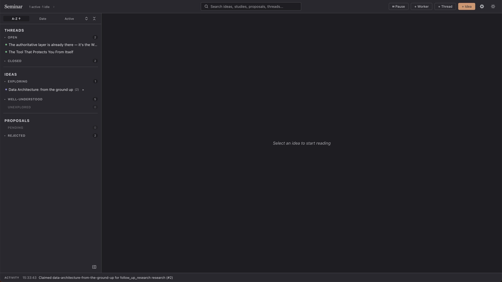
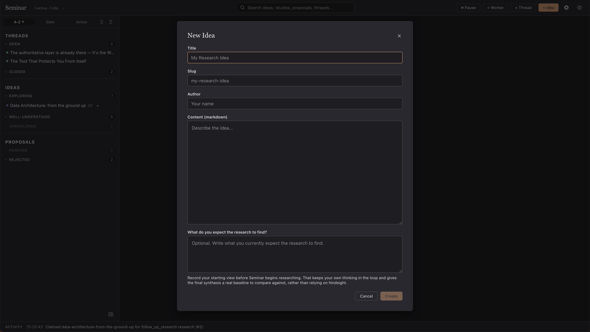

# Seminar




Seminar is a local research desk where AI agents investigate ideas from multiple angles over time.

Drop in an idea and leave it alone for a while. Seminar turns it into ongoing research: workers study it from different angles, revisit it over time, surface tensions or gaps, and propose new threads when the existing work suggests there is more to explore.

When you come back, you'll have a growing body of studies, a queue of follow-up proposals, and a dashboard for deciding what to pursue, approve, reject, or close. Good thinking needs more than one perspective. Seminar helps you surface them early.

Seminar runs locally and uses the tools you already have. It does not ship its own model backend; instead, it runs agents through [Claude Code](https://claude.com/claude-code) or [Codex](https://github.com/openai/codex), so it fits into an existing Claude or OpenAI workflow.

## How it works

Three kinds of workers run against the queue on their own schedule:

- Initial exploration: claims unexplored ideas and writes the first study.
- Follow-up research: revisits studied ideas from a new angle, or writes the final synthesis when the topic is ready to close.
- Connective research: reads across the corpus and proposes new ideas the existing studies suggest but don't address.

Workers can also propose follow-up ideas, which you approve or reject from the dashboard.

A study is a long-form research document (750+ words) written by a worker agent. Each study takes a deliberate angle on the idea: a deep dive, a contrarian take, a cross-discipline connection, a concrete case study. Studies are required to be well-sourced. Multiple studies accumulate on the same idea over time, each adding a new perspective, until a final synthesis study closes it out.

## Quick start

Requirements: Python 3.10+, `uv`, Node.js 18+, npm, and Claude Code or Codex installed locally.

```bash
git clone https://github.com/hgrsd/seminar
cd seminar
./install.sh
```

The installer builds the frontend, installs the `seminar` CLI, and runs `seminar init` once to bootstrap local state and install the default worker skills.

Then:

```bash
seminar
```

The dashboard opens at `http://127.0.0.1:8765`. Pass `--headless` to skip the browser.

Open Settings in the dashboard to choose the provider, adjust the agent command, set worker counts and timing, and tell agents what tools and local resources they can use.

## Configuration

`seminar init` creates `~/.seminar/config.json` and installs the default worker skill templates into `~/.seminar/skills`. Ongoing configuration is managed from the dashboard's Settings modal.

Settings currently cover:

| Key | Purpose |
| --- | --- |
| `data_dir` | Where state, logs, and study artifacts live |
| `provider` | `claude-code` or `codex` |
| `agent_cmd` | The exact (non-interactive, permission-skipping) command used to launch the agent |
| `workers.{initial,follow_up,connective}` | Number of workers of each type |
| `intervals.*` | Poll interval, in seconds, per worker type |
| `timeouts.*` | Per-run timeout, in seconds, per worker type |
| `follow_up_research_cooldown_minutes` | Minimum gap before an idea is re-studied |
| `tools` | Notes for agents about the tools, files, sites, or other resources available in your environment |

Use the Tools field in Settings for simple notes like "use `gh` for GitHub data", "check our internal wiki first", or "read this local folder before going to the web."

## Storage

Everything lives under `data_dir`:

- `state.db`: durable state, including all studies
- `logs/`: worker run logs
- `scratch/`: per-run working directories and study artefacts
- `skills/`: installed worker prompt templates used at runtime

## CLI

The dashboard covers the human workflow, including configuration. Most CLI commands are intended for workers and external agents: they are how agents claim ideas, submit studies, and propose follow-ups without going through the UI. The handful of exceptions are bootstrap or administrative operations such as `init`, pausing, resetting, and wiping the database.

```text
seminar [--headless]           # launch server + dashboard
seminar init [--provider <name>]
seminar pause | resume
seminar status [slug]
seminar done <slug>
seminar reset <slug> | reset-all
seminar nuke-db
seminar uninstall

seminar ideas list
seminar ideas read <slug>
seminar ideas propose <slug> <parent-slug>... [--title <title>] --author <name>

seminar proposals list
seminar proposals approve <slug>
seminar proposals reject <slug>

seminar studies list <slug>
seminar studies read <slug> <study-number>
seminar complete-study <slug> <study-number> <markdown-path> [--mode <mode>] --title <title>
```

## Development

```bash
# backend
uv tool install -e .
uv run --group dev pytest

# frontend
cd src/seminar/server/frontend
npm install
npm run build
```
